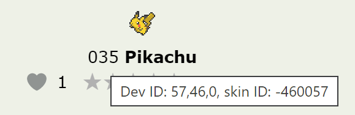

.. _pokemon_generation:

####################
|Pokemon| Generation
####################

|Pokemon| are complex creatures. There are dozens of ways they can be customized and configured for battling or spawning.

|Pokemon| can be generated using **generation strings**, which are a series of options separated by semicolons. For instance, :code:`pikachu;level 25;male` would generate a mal, level 25 Pikachu. If given to the :jcoad:trigger:`battle` trigger, a battle with this wild |Pokemon| would be initiated. If given to the :jcoad:trigger:`mon` trigger, the |Pokemon| would be given directly to the player.

These strings are also used in the battle simulator.

|Pokemon| Identification
============================

The first option in the generation string should be an identification string. This string identifies the exact |Pokemon|, stored in some Dex on |Pokengine|, that should be generated. The format is:

.. code-block::

    pokemon,pokedex,form

Here are some simple examples:

    :code:`pikachu` |emdash| No Dex given, so uses the lowest ID first (Nintendo, not Aristos).

    :code:`pikachu,nintendo` |emdash| Explicitly uses Pikachu from the Nintendo Dex.

    :code:`pikachu,aristos` |emdash| Explicitly uses Pikachu from the Aristos Dex.

    :code:`25,1,0` |emdash| Dev ID for Pikachu from the Nintendo Dex.

    :code:`57,46,0` |emdash| Dev ID for Pikachu from the Aristos Dex.

If you are unsure what string to use, hover over a |Pokemon|'s dex number on its Dex page, and use the "Dev ID."

|Pokemon| Generation Options
============================

The following options can be placed after the identification string, in any order. All options should be separated by semicolons.

.. jcoad:pokeoption:: uid
    :suffix: id

    Set the |Pokemon|'s unique identifier. Can be any 32-bit, unsigned integer, or an integer between 0 and 4,294,967,295.

.. jcoad:pokeoption:: dynamic-level
    d

    Use dynamic leveling.

.. jcoad:pokeoption:: level
    lv
    l
    :suffix: levels
    :examples:
        pikachu;level 5
        pikachu;level 5,10,15
        pikachu;level 5-15
        pikachu;level same

    Set the |Pokemon|'s level. Can be a single number, multiple comma-separated values, or a range of values. Use :code:`same` if initiating a trade and you want the new |Pokemon| to be the same level as the traded |Pokemon|.

.. jcoad:pokeoption:: nickname
    nick
    name
    n
    :suffix: name

    Set the |Pokemon|'s nickname.

.. jcoad:pokeoption:: male
    m

    Set the |Pokemon| as male.

.. jcoad:pokeoption:: female
    f

    Set the |Pokemon| as female.

.. jcoad:pokeoption:: status
    q
    :suffix: status

    Set the |Pokemon|'s status.

.. jcoad:pokeoption:: hp
    h
    :suffix: hp

    Set the |Pokemon|'s current HP.

.. jcoad:pokeoption:: exp
    x
    :suffix: exp

    Set the |Pokemon|'s current EXP.

.. jcoad:pokeoption:: ability
    a
    :suffix: ability

    Set the |Pokemon|'s ability.

.. jcoad:pokeoption:: nature
    p
    :suffix: nature

    Set the |Pokemon|'s nature.

.. jcoad:pokeoption:: moves
    o
    :suffix: move1,move2,move3,move4

    Set the |Pokemon|'s moveset.

.. jcoad:pokeoption:: item
    b
    :suffix: item

    Set the |Pokemon|'s held item.

.. jcoad:pokeoption:: happiness
    friendship
    w
    :suffix: value

    Set the |Pokemon|'s happiness/friendship value. Should be between 0 and 255, inclusive.

.. jcoad:pokeoption:: egg
    y
    :suffix: steps

    Set the |Pokemon| as an egg with the given number of steps required to hatch.

.. jcoad:pokeoption:: ivs
    i
    :suffix: iv_values
    :examples:
        pikachu;ivs 31,0,31,31,31,31

    Set the |Pokemon|'s IV values.

.. jcoad:pokeoption:: evs
    e
    :suffix: ev_values
    :examples:
        pikachu;evs 252,0,0,252,0,4

    Set the |Pokemon|'s EV values.

.. jcoad:pokeoption:: shiny
    s
    :suffix: [value]

    Set the |Pokemon| as shiny or not. Use :code:`?` for a random chance of shiny. Use :code:`no` or :code:`0` for shiny locked. Any other value, or no value at all, sets the |Pokemon| as shiny.

.. jcoad:pokeoption:: caught
    c
    :suffix: caught_string
    :examples:
        caught @1604587291by2560in1on1328lv60

    Set the |Pokemon|'s caught data. Caught strings are another type of string that must be formatted. Every option must appear continuously.

    :code:`@[time]` |emdash| Set the time when caught

    :code:`by[player_id]` |emdash| Set the player who caught the |Pokemon|

    :code:`in[item_id]` |emdash| Set the PokéBall the |Pokemon| was caught in

    :code:`on[map_id]` |emdash| Set where the |Pokemon| was caught

    :code:`lv[level]` |emdash| Set what level the |Pokemon| was caught at

Here is a complex example of a |Pokemon| generation string:

    .. code-block::

        pikachu,aristos;level 25;male;shiny;name PikaPika;moves 344,231,85,98;item everstone;caught in16

This string represents a Pikachu from the Aristos Dex. It is male, level 25, and shiny. It is named "PikaPika." It has the moves Volt Tackle, Iron Tail, Thunderbolt, and Quick Attack. It is holding an everstone, and it is caught in a Cherish Ball.
